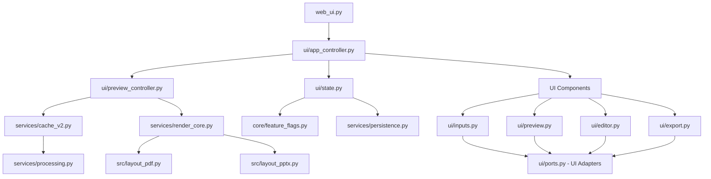
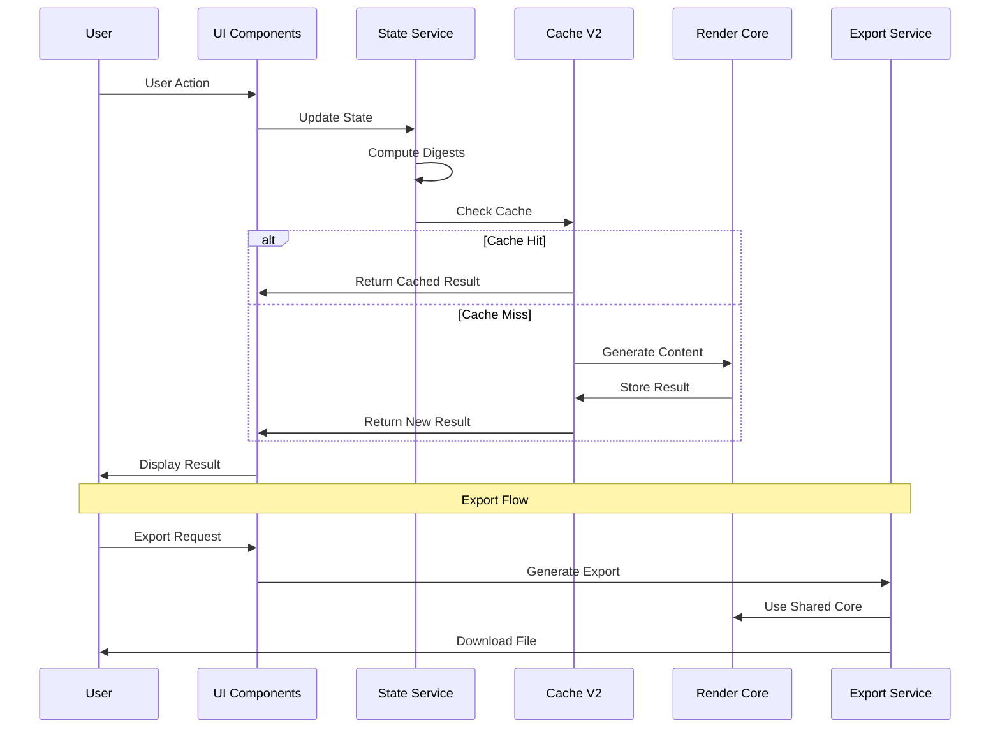

# Architecture Documentation

## Overview

The Chinese Character Learning Cards application has undergone a comprehensive UI refactor implementing a layered, framework-agnostic architecture. The system now features unified preview pipelines, digest-driven invalidation, UI adapter abstraction, and comprehensive state management.

## Architecture Principles

### 1. Layered Architecture
- **UI Layer**: Framework-agnostic components using UI adapters
- **Service Layer**: Business logic and data processing
- **Core Layer**: State management, feature flags, and utilities
- **Infrastructure Layer**: Persistence, caching, and monitoring

### 2. Digest-Driven Invalidation
- Deterministic digest computation for cache invalidation
- Domain-specific digests (processing, layout, style, navigation)
- Single source of truth for cache invalidation decisions

### 3. Framework Abstraction
- UI Adapter pattern isolates framework dependencies
- Components work with any UI framework (Streamlit, web, CLI)
- Clean separation between business logic and presentation

## Directory Structure

```text
├── web_ui.py                 # Main Streamlit application entry point
├── core/                     # Core infrastructure
│   ├── constants.py          # Application constants and defaults
│   ├── feature_flags.py      # Feature flag system
│   ├── field_migration.py    # Data migration utilities
│   └── version.py            # Code version management
├── services/                 # Business logic layer
│   ├── cache_v2.py           # V2 caching with schema versioning
│   ├── export.py             # Export functionality (PPTX/PDF)
│   ├── layout.py             # Layout computation services
│   ├── persistence.py        # Browser storage and snapshots
│   ├── processing.py         # Text processing and data generation
│   ├── render_core.py        # Shared rendering logic
│   ├── rollout.py            # Feature rollout management
│   └── telemetry.py          # Performance monitoring
├── ui/                       # UI layer (framework-agnostic)
│   ├── app_controller.py     # Main application controller
│   ├── editor.py             # Table-based card editor
│   ├── export.py             # Export UI components
│   ├── inputs.py             # Input handling components
│   ├── options.py            # Configuration options
│   ├── ports.py              # UI adapter interfaces
│   ├── preview.py            # Preview components
│   ├── preview_controller.py # Preview pipeline controller
│   ├── sidebar.py            # Sidebar components
│   ├── state.py              # State service with rule engine
│   └── styles.py             # CSS and styling utilities

├── src/                      # Framework-agnostic source modules
│   ├── dict_utils.py         # Dictionary utilities
│   ├── layout_pdf.py         # PDF generation
│   ├── layout_pptx.py        # PowerPoint generation
│   └── pinyin_utils.py       # Pinyin generation utilities
└── tests/                    # Comprehensive test suite
    ├── integration/          # Integration tests
    ├── ui/                   # UI component tests
    └── unit/                 # Unit tests
```

## Architecture Diagram



## Core Architecture Components

### State Management Layer

#### `ui/state.py` - State Service
- **Rule Engine**: Automatic field normalization and validation
- **Batch Operations**: Atomic state updates with change tracking
- **Digest Computation**: Deterministic cache invalidation
- **Session Management**: Session generation and lifecycle
- **Change Detection**: Domain-specific change tracking

#### `core/feature_flags.py` - Feature Flag System
- **Environment Integration**: Support for env vars, config files
- **Rollout Management**: Gradual feature rollout capabilities
- **Testing Overrides**: Test-specific flag configurations
- **Priority Hierarchy**: test > env > config > remote > defaults

### Service Layer

#### `services/cache_v2.py` - Advanced Caching System

- **Schema Versioning**: PREVIEW_CACHE_SCHEMA_VERSION and EXPORT_SCHEMA_VERSION
- **Content Versioning**: Code version integration for cache invalidation
- **TTL Management**: Time-based cache expiration
- **Size Limits**: Memory-aware cache eviction policies
- **Performance Monitoring**: Cache hit/miss statistics

#### `services/render_core.py` - Shared Rendering Engine

- **Unified Rendering**: Single rendering pipeline for preview and export
- **Template Composition**: Consistent HTML/layout generation
- **Font Fallback**: Robust font handling across formats
- **Line Height Normalization**: Consistent typography rendering
- **Format Abstraction**: Support for HTML, PDF, PPTX output

#### `services/persistence.py` - Browser Storage Management

- **UserSnapshot System**: Versioned JSON snapshots with migration
- **Storage Quota**: Graceful degradation when storage limits exceeded
- **Data Migration**: Automatic schema evolution and backward compatibility
- **Export History**: Cleanup policies (max 50 records, 30 days)
- **Kill Switch**: DISABLE_PERSISTENCE for emergency scenarios

#### `services/rollout.py` - Feature Rollout Management

- **Gradual Rollout**: Percentage-based feature deployment
- **A/B Testing**: Statistical experiment management
- **Canary Deployment**: Small-scale validation before full rollout
- **Automated Rollback**: Safety triggers based on error rates and performance
- **User Segmentation**: Targeted feature deployment

### UI Layer (Framework-Agnostic)

#### `ui/ports.py` - UI Adapter System

- **UIAdapter Interface**: Framework abstraction layer
- **StreamlitAdapter**: Streamlit-specific implementation
- **FakeAdapter**: Testing and development adapter
- **Port Interfaces**: Inputs, Preview, Notification, Refresh scheduling
- **Framework Independence**: Components work with any UI framework

#### `ui/preview_controller.py` - Preview Pipeline Controller

- **Unified Pipeline**: Single entry point for all preview rendering
- **Digest-Driven Caching**: Intelligent cache invalidation
- **AppConfig Composition**: Configuration aggregation and validation
- **Navigation Clamping**: Automatic page boundary enforcement
- **Fallback Handling**: Graceful degradation on rendering failures

## Data Flow Architecture

### 1. Request Processing Flow



### 2. State Management Flow

1. **User Interaction**: UI components capture user input
2. **State Updates**: Changes routed through `ui/state.py` service
3. **Rule Engine**: Automatic field normalization and validation
4. **Digest Computation**: Domain-specific digests computed
5. **Change Detection**: Affected domains identified
6. **Cache Invalidation**: Targeted cache clearing based on digests
7. **UI Refresh**: Components re-render with new state

### 3. Preview Pipeline Flow

1. **Configuration**: AppConfig assembled from current state
2. **Digest Check**: Preview params digest computed
3. **Cache Lookup**: Check for cached preview with matching digest
4. **Rendering**: Generate new preview if cache miss
5. **Storage**: Cache result with digest key
6. **Display**: Return HTML to UI components

## Key Design Principles

### 1. Framework Independence

- **UI Adapter Pattern**: All UI interactions go through adapter interfaces
- **Business Logic Isolation**: Core logic independent of UI framework
- **Testing Support**: FakeAdapter enables comprehensive testing
- **Future Flexibility**: Easy migration to different UI frameworks

### 2. Digest-Driven Architecture

- **Deterministic Caching**: Reproducible cache keys based on content
- **Selective Invalidation**: Only affected caches are cleared
- **Performance Optimization**: Minimal unnecessary recomputation
- **Debugging Support**: Clear cache miss diagnosis

### 3. Shared Render Core

- **Consistency Guarantee**: Preview and export use identical rendering logic
- **Template Reuse**: Common HTML/layout generation
- **Format Abstraction**: Support for multiple output formats
- **Performance Optimization**: Shared computation and caching

### 4. State Service Architecture

- **Centralized Management**: Single source of truth for application state
- **Rule Engine**: Automatic validation and normalization
- **Batch Operations**: Atomic updates with change tracking
- **Session Isolation**: Multi-user support with session boundaries

## Performance Architecture

### Caching Strategy

1. **Multi-Level Caching**
   - **Session Cache**: In-memory cache for current session
   - **Preview Cache**: Digest-keyed HTML previews
   - **Export Cache**: Content-versioned export data

2. **Cache Invalidation**
   - **Digest-Driven**: Only affected caches cleared
   - **Domain-Specific**: Separate digests for different concerns
   - **Automatic**: No manual cache management required

3. **Performance Targets**
   - **First Render**: <500ms after digest change
   - **Cached Render**: <100ms for cache hits
   - **Memory Usage**: <50MB total application memory
   - **Cache Hit Rate**: >80% for typical usage patterns

### Monitoring and Telemetry

- **Performance Metrics**: Browser Performance API integration
- **Cache Analytics**: Hit/miss rates and performance tracking
- **Error Tracking**: Structured logging with correlation IDs
- **Memory Monitoring**: Usage tracking and leak detection

## Testing Architecture

### Comprehensive Test Strategy

1. **Unit Tests**
   - Pure functions in `services/processing.py`
   - State service rule engine validation
   - Digest computation correctness
   - Cache behavior verification

2. **Integration Tests**
   - UI adapter system integration
   - Preview pipeline end-to-end testing
   - State management across components
   - Export consistency validation

3. **End-to-End Tests**
   - Complete user workflow testing
   - Event-driven testing (no hardcoded delays)
   - Cross-browser compatibility
   - Performance regression detection

4. **Golden Tests**
   - Preview-export consistency validation
   - Typography and layout consistency
   - HTML output normalization

### Test Coverage Targets

- **Unit Tests**: >90% coverage for core logic
- **Integration Tests**: All adapter paths covered
- **E2E Tests**: Critical user workflows
- **Performance Tests**: Baseline establishment and regression detection

## Migration and Compatibility

### Data Migration Strategy

1. **Automatic Migration**
   - Version detection and automatic upgrade
   - Backward compatibility for old data formats
   - Graceful handling of schema evolution

2. **Rollback Capability**
   - Safe rollback to previous versions
   - Data integrity preservation
   - User notification of migration status

3. **Testing Matrix**
   - Historical data format compatibility
   - Browser version compatibility
   - Streamlit version compatibility

### Feature Flag Rollout

1. **Gradual Deployment**
   - Percentage-based rollout
   - User segmentation support
   - A/B testing capabilities

2. **Safety Mechanisms**
   - Automated rollback triggers
   - Performance monitoring
   - Error rate thresholds

3. **Monitoring**
   - Real-time rollout status
   - User feedback collection
   - Performance impact tracking

## Dependencies and Technology Stack

### Core Dependencies

- **Streamlit**: Web framework and UI components
- **jieba**: Chinese text segmentation
- **python-pptx**: PowerPoint generation
- **reportlab**: PDF generation
- **pandas**: Data manipulation and CSV handling

### Development Dependencies

- **pytest**: Testing framework
- **pytest-cov**: Coverage reporting
- **black**: Code formatting
- **mypy**: Type checking
- **pre-commit**: Git hooks for quality assurance

### Browser Dependencies

- **localStorage**: Client-side persistence
- **Performance API**: Performance monitoring
- **CSS Grid/Flexbox**: Modern layout support

## Security Considerations

### Input Validation

- **XSS Protection**: HTML sanitization for user inputs
- **CSV Validation**: Safe parsing of uploaded files
- **Size Limits**: Protection against resource exhaustion

### Data Protection

- **Local Storage Only**: No server-side data persistence
- **Session Isolation**: Multi-user session boundaries
- **Secure Defaults**: Conservative security settings

### Content Security Policy

- **HTML Preview**: CSP headers for generated content
- **Script Execution**: Controlled JavaScript execution
- **Resource Loading**: Restricted external resource access

## Deployment and Operations

### Environment Configuration

- **Feature Flags**: Environment-specific flag configuration
- **Performance Tuning**: Cache size and TTL configuration
- **Monitoring**: Telemetry and logging configuration

### Monitoring and Alerting

- **Performance Metrics**: Response time and throughput monitoring
- **Error Tracking**: Structured error logging and alerting
- **Resource Usage**: Memory and storage monitoring
- **User Analytics**: Usage patterns and feature adoption

### Maintenance Procedures

- **Cache Management**: Automated cache cleanup and optimization
- **Data Migration**: Scheduled migration and validation procedures
- **Performance Optimization**: Regular performance review and tuning
- **Security Updates**: Dependency updates and vulnerability scanning

---

**Document Version**: 2.0
**Last Updated**: August 2024
**Architecture Version**: Post-UI Refactor
**Next Review**: November 2024
