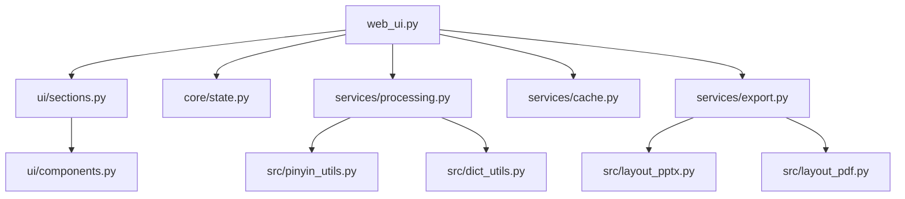

# Architecture Documentation

## Overview

The Chinese Character Learning Cards application has been refactored into a modular, maintainable architecture. The main `web_ui.py` file has been reduced to 34 lines through systematic extraction of concerns.

## Directory Structure

Root placement conventions:

- Root contains only: web_ui.py, README, requirements, high-level docs, core directories (core/, services/, ui/, src/, docs/, tests/, data/, samples/, out/)
- Tests live in tests/
- Documentation lives in docs/
- Framework-agnostic modules live in src/; services wrap them for app use; UI does not import src directly

```text
├── web_ui.py                 # Main Streamlit application (163 lines)
├── core/
│   ├── constants.py          # Application constants and defaults
│   └── state.py              # Session state management
├── services/
│   ├── cache.py              # Cached functions and HTML generation
│   ├── export.py             # Export functionality (PPTX/PDF)
│   └── processing.py         # Text processing and data generation
├── ui/
│   ├── components.py         # Reusable UI components
│   ├── sections.py           # Major page sections
│   └── styles.py             # CSS and styling utilities


## Architecture Diagram


```text
└── src/                      # Original source modules
    ├── pinyin_utils.py       # Pinyin generation utilities
    ├── dict_utils.py         # Dictionary utilities
    ├── layout_pptx.py        # PowerPoint generation
    └── layout_pdf.py         # PDF generation
```

## Module Responsibilities

### Core Modules

#### `core/constants.py`

- Application-wide constants (colors, fonts, defaults)
- Font options for Chinese characters
- Preset color palette
- Default layout and page settings

#### `core/state.py`

- Centralized session state management
- Getter/setter functions for clean access
- State validation and initialization
- Export state tracking

### Service Modules

#### `services/cache.py`

- Cached HTML generation functions
- Page preview rendering with realistic layout
- Simple grid preview for quick viewing
- Streamlit cache decorators

#### `services/export.py`

- Export functionality for PPTX and PDF formats
- Encapsulates layout generator calls
- Handles temporary file management
- Error handling and cleanup

#### `services/processing.py`

- Pure functions for text processing
- Input text parsing (space-separated Chinese)
- Intelligent text segmentation using jieba
- Missing data generation (pinyin/translations)

### UI Modules

#### `ui/components.py`

- Reusable UI components
- Color palette selector with fallback
- Pagination navigation controls
- Preview section rendering
- Page information display

#### `ui/sections.py`

- Major page sections as functions
- Sidebar with statistics and history
- Input section (manual/CSV upload)
- Options and advanced settings
- Preview wrapper with editing
- Export section with download buttons

#### `ui/styles.py`

- CSS styling utilities
- Global style application
- Sticky wrapper helpers

## Data Flow

1. **Initialization**: `core/state.py` initializes all session state variables
2. **Input**: `ui/sections.py` handles user input (text or CSV)
3. **Processing**: `services/processing.py` parses and enriches data
4. **Caching**: `services/cache.py` generates cached HTML previews
5. **Display**: `ui/components.py` renders UI elements
6. **Export**: `services/export.py` generates downloadable files

## Key Design Principles

### Separation of Concerns

- UI logic separated from business logic
- Pure functions for data processing
- Centralized state management
- Modular component architecture

### Caching Strategy

- HTML generation is cached for performance
- Export data is cached to avoid regeneration
- Parameter change detection clears relevant caches

### Error Handling

- Graceful fallbacks for component failures
- Validation of user inputs and state
- Proper cleanup of temporary files

### Maintainability

- Small, focused modules (each <300 lines)
- Clear naming conventions
- Comprehensive documentation
- Consistent import patterns

## Performance Optimizations

1. **Streamlit Caching**: Heavy HTML generation is cached
2. **Lazy Loading**: Components only render when needed
3. **State Management**: Efficient change detection
4. **Memory Management**: Proper cleanup of temporary files

## Testing Strategy

- **Unit Tests**: Pure functions in `services/processing.py`
- **Integration Tests**: Component rendering and state management
- **Manual Testing**: Full user workflow verification
- **Performance Tests**: Cache effectiveness and memory usage

## Testing Strategy

### Unit Tests
- **Location**: `tests/unit/`
- **Coverage**: Core business logic, utilities, and data processing
- **Framework**: pytest
- **Key Areas**: Pinyin generation, dictionary utilities, text processing

### Integration Tests
- **Location**: `tests/integration/`
- **Coverage**: Service layer interactions, file I/O, external dependencies
- **Framework**: pytest
- **Key Areas**: Export functionality, template processing, cache operations

### UI Tests
- **Location**: `tests/ui/`
- **Coverage**: Streamlit components, user interactions, visual elements
- **Framework**: pytest with Streamlit testing utilities
- **Key Areas**: Component rendering, state management, user workflows

### End-to-End (E2E) Tests
- **Location**: `tests/playwright-ts/`
- **Coverage**: Complete user workflows, browser interactions, visual validation
- **Framework**: Playwright with TypeScript
- **Key Areas**:
  - Auto features (pinyin/translation generation)
  - Basic input flow and card generation
  - Card size adjustment functionality
  - Preview mode switching
- **Test Count**: 12 tests, 100% passing
- **Documentation**: See `docs/E2E_TESTS_DOCUMENTATION.md` for detailed coverage

## Future Improvements

1. **Component Library**: Extract more reusable components
2. **Theme System**: Configurable color schemes and fonts
3. **Plugin Architecture**: Extensible export formats
4. **Internationalization**: Multi-language support
5. **Advanced Caching**: Redis or database-backed caching

## Migration Notes

The refactoring maintains full backward compatibility:

- All original functionality preserved
- Same user interface and experience
- Identical export formats and quality
- No breaking changes to existing workflows

## Dependencies

- **Streamlit**: Web framework
- **jieba**: Chinese text segmentation
- **python-pptx**: PowerPoint generation
- **reportlab**: PDF generation
- **pandas**: Data manipulation
- **Custom modules**: Pinyin and dictionary utilities
