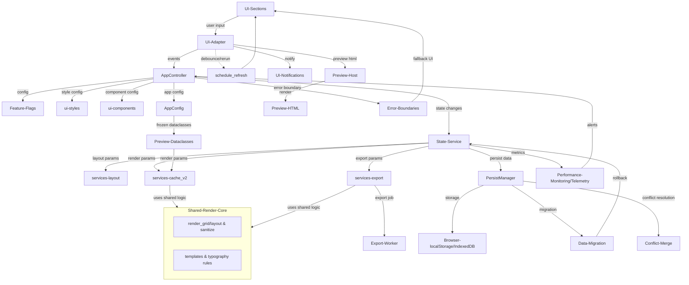
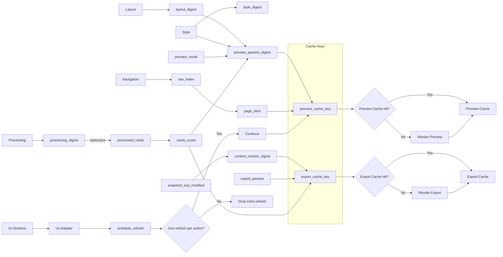
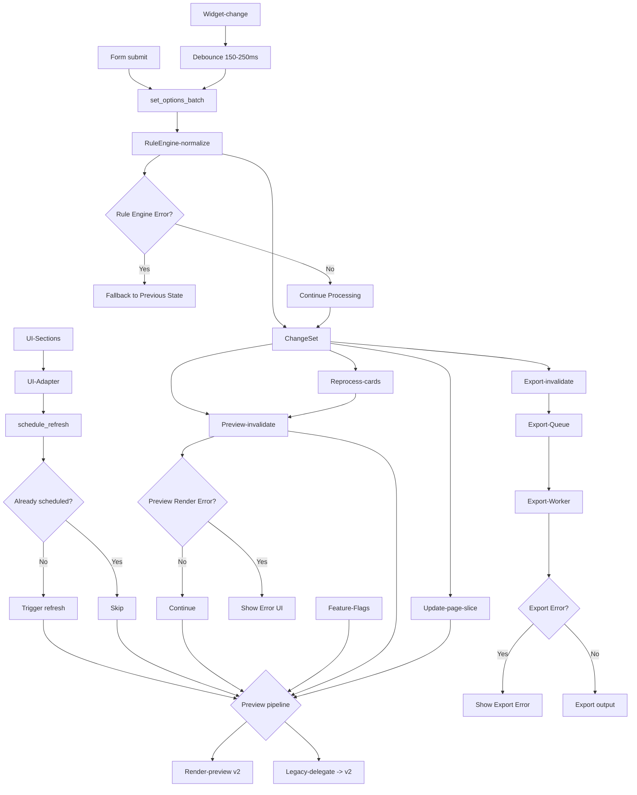

## UI Refactor Technical Design Specification

### 1. Executive Summary
Refactor the UI stack to reduce complexity, make behavior predictable, and improve performance. Adopt a layered architecture (UI → Controller → State Service → Services), digest‑driven invalidation with framework‑agnostic gating (adapter encapsulates framework specifics), deterministic per‑browser persistence, and a single preview pipeline with frozen dataclasses. Eliminate legacy paths; standardize naming, units, and APIs.

Key outcomes:
- Scoped reruns with domain digests; no global cache clears
- Centralized state transitions (rules, batching, invalidation, persistence)
- Unified preview pipeline (AppConfig → Preview dataclasses)
- Local persistence via versioned JSON snapshots + migration
- Scalable editor with stable, deterministic per‑row IDs
- Comprehensive error handling and recovery mechanisms
- Performance monitoring with specific benchmarks
- Backward compatibility with gradual migration strategy
- **Improved Developer Experience (DX)** through a more predictable and maintainable architecture

### 2. Problem Statement
- sections.py mixes UI, state, and business logic; cache clears and session writes are scattered
- Preview path duplication (legacy/wrapper/new) with drift in param tracking and reset logic
- Excessive rerun blast radius; style‑only changes sometimes reset navigation
- Tabbed editor doesn't scale; no persistence across page closes
- Lack of proper error boundaries and recovery mechanisms
- No performance monitoring or benchmarks
- Missing backward compatibility strategy for existing user data
- Poor developer experience due to high cognitive load and unpredictable side effects

### 3. Solution Overview
Architecture:
- UI: render + intentful setters; no direct session writes
- AppController: compose AppConfig, orchestrate flows, invoke preview/editor
- State Service (ui/state.py): single write barrier (rules, batching, digests, invalidation, persistence)
- Services: layout math, preview HTML (services/cache_v2), export
- Persistence: localStorage + versioned JSON snapshots + migrations
- Error Handling: error boundaries, fallback mechanisms, graceful degradation
- Performance: monitoring, benchmarks, regression detection
- **Developer Experience**: Debug tooling, clear separation of concerns, and updated documentation
- **UI Adapter Layer**: UI interacts with a framework-agnostic `UIAdapter` instead of Streamlit APIs directly; rerun/debounce/form semantics are encapsulated in the adapter

Decisions:
- Domain digests (processing/layout/style/navigation) drive invalidation; page‑slice updates don't invalidate preview
- One preview path: render_preview_content(processed_cards, AppConfig); legacy wrappers delegate to v2
- Frozen dataclasses (LayoutOptions, Typography, VisualOptions) only in services/cache_v2; AppConfig remains UI contract
- Editor uses a framework-agnostic table editor (via adapter) + Apply by deterministic id; diffs by id, not index
- Cache keys include digest + session_generation + code_version + schema_version; never call st.cache_data.clear()
- Error boundaries at component level with fallback UI
- Performance monitoring with specific benchmarks and regression alerts
- Backward compatibility through data migration and feature flags

### 4. Detailed Design

4.0 UI Ports / Adapter Layer
- Goal: decouple UI code from Streamlit so we can swap to other frameworks (e.g., React+FastAPI, PySide, Textual) without touching domain/state/render/export logic.
- Interfaces (ui/ports.py):
  - `UIAdapter` aggregates: `UIInputsPort`, `UIPreviewPort`, `UINotificationPort`, `UIRefreshScheduler`.
  - `UIInputsPort`: text/checkbox/select/color/file_uploader/button/form; all accept `on_change`/`on_click` handlers `(event_name, payload)`.
  - `UIRefreshScheduler.schedule_refresh(debounce_ms=0)`: schedules a UI refresh; Streamlit impl does debounce(150–250ms)+`st.rerun()`. Other frameworks map to setState/signals.
  - `UIFormContext`: context manager with `on_submit(handler)` to batch-set options.
- Streamlit Adapter (ui/adapters/streamlit_adapter.py): implements ports via Streamlit; hides `st.form`, `st.rerun`, debounce.
- FakeAdapter: in-memory adapter for tests; records events and refresh calls.
- Contract rules:
  - UI code MUST NOT call `st.*` directly; only use `UIAdapter`.
  - Refreshes MUST go through `schedule_refresh`; one user action → at most one refresh.
  - No cache clears or persistence writes from UI; go through State Service.
- Feature flag: `FEATURE_UI_ADAPTER={streamlit|fake|custom}`; default `streamlit`.
- Migration plan:
  1) Introduce ports and StreamlitAdapter, keep old path.
  2) Migrate one small section as a showcase behind flag.
  3) Expand coverage section-by-section; remove direct Streamlit calls.
  4) When parity is reached (golden tests pass), make adapter default; keep legacy as fallback.
- Testing:
  - Unit: FakeAdapter behavior; refresh debouncing; form submit → set_options_batch.
  - Integration: full flow using FakeAdapter; assert single refresh per action.
  - E2E: unchanged; measure first frame and rerun counts in dev.

4.1 State domains and keys
- Keys: layout.rows/cols/auto_fill, layout.gap_cm/margin_cm/card_size; ui.hanzi_font/ui.background_color/ui.preview_mode; nav.current_page (nav_index); caches.preview_params_digest
- Domains:
  - Processing: input_text, auto_pinyin, auto_translate, translate_order, segmentation
  - Layout: rows, cols, gap_cm, margin_cm, page_size, auto_fill, card_size
  - Style: hanzi_font_size_pt, pinyin_font_size_pt, english_font_size_pt, hanzi_font, background_color
  - Navigation: nav_index (int)

4.2 Digests & invalidation
- normalize_for_digest: round floats to 4 decimals; sort sets; stringify Decimals; JSON‑serializable only
- processing_digest = stable_digest({input_text, auto_pinyin, auto_translate, translate_order})
- layout_digest = stable_digest({rows, cols, gap_cm, margin_cm, page_size, auto_fill, card_size})
- style_digest = stable_digest({hanzi_font_size_pt, pinyin_font_size_pt, english_font_size_pt, hanzi_font, background_color})
- PREVIEW_CACHE_SCHEMA_VERSION / EXPORT_SCHEMA_VERSION constants; include code_version in cached args
- preview_params_digest = stable_digest({layout_digest, style_digest, preview_mode, cards_count, PREVIEW_CACHE_SCHEMA_VERSION, code_version})
- Page‑slice key = (preview_params_digest, nav_index)
- Reset policy: reset/clamp nav_index only when cards_per_page or cards_count changes; style‑only never resets
- Never hash processed_cards content into preview_params_digest (use count only)
- **Debuggability**: In development mode, introduce a debug panel or detailed logs to trace digest calculations. This will show the raw, pre-normalized inputs and final hash for each domain digest, simplifying the debugging of cache misses.

4.3 Rule engine & batching
- set_option accumulates into pending_changes; set_options_batch applies atomically
- Precedence:
  1) Explicit user changes
  2) If card_size adjusted → layout.auto_fill=False
  3) If layout.auto_fill=True → recompute card_size from layout
  4) If page_size/layout changed and auto_fill=True → recompute card_size
- ChangeSet flags: affects_processing/layout/style/navigation/export; nav_reset_required
- Single granular invalidation at end‑of‑run; avoid on_change reruns mid‑flight
- Rule Engine truth table (examples):
  - User sets card_size → auto_fill off; affects_layout=true; nav_reset depends on cards_per_page change
  - User toggles auto_fill on → recompute card_size; affects_layout=true; nav_reset depends on cards_per_page change
  - User changes font size → affects_style=true; nav_reset=false

4.4 Preview pipeline
- Controller composes AppConfig post‑hydration; converts to dataclasses at services boundary (UI stays AppConfig‑only)
- services/cache_v2 APIs add PREVIEW_CACHE_SCHEMA_VERSION + code_version to cache keys
- Immediate vs cached: first render after digest change is immediate; subsequent renders cached by preview_params_digest / page‑slice key
- Legacy preview functions delegate to v2

4.5 Editor
- **Card ID Stability**: Each card gets a stable UUID upon first creation, stored in UserSnapshot. Content hash (sha256(normalized(hanzi+pinyin+english))) is used only for duplicate detection, not as the primary ID. This ensures that editing card content doesn't break the "merge by ID" functionality.
- Framework-agnostic table editor (via adapter) with paging/search; Apply merges by stable UUID; preserve order; conflict policy: latest edit wins; invalidate preview once
- Card data model: `{id: str, hanzi: str, pinyin: str, english: str, version: int, created_at: datetime}`

4.6 Persistence
- UserSnapshot(version:int, input_text:str, options:dict, layout:dict, typography:dict, visual:dict, preview:dict, cards: List[Card], export_history: List[ExportRecord])
- migrate_snapshot(old)->new; ignore unknowns, default missing; JSON validate/coerce
- components/browser_storage: hydrate_once (single rerun), schedule_save (debounce), flush_if_due (end‑of‑run)
- Limits: cap input_text and total snapshot (~1 MB); warn/truncate; component listens to storage events and prompts on "newer settings detected"
- **Future Evolution**: While `localStorage` is sufficient for initial implementation, **`IndexedDB`** will be considered as a future upgrade path to support larger user states and overcome storage limitations.
- **Storage Quota Management**: Detect browser storage limits and quota usage. Implement graceful degradation when storage is disabled or quota exceeded. Provide "disable persistence" kill-switch via environment variable `DISABLE_PERSISTENCE=true`.
- **Multi-tab Consistency**: Use `last_modified` timestamps and version numbers to detect conflicts. Show user-friendly conflict resolution UI with option to merge or overwrite.
- **JSON Serialization & Time/Timezone Policy**: Store all datetime fields as ISO‑8601 UTC strings `YYYY‑MM‑DDTHH:mm:ss.sssZ`. Only persist JSON‑serializable primitives in localStorage/IndexedDB (no binary/Date objects). Define time sources: browser time for UI events, server/build time for code_version markers; handle clock skew by trusting server timestamps when available.
- **Time Sources & Clock Skew**: Use browser time for UI interactions and local events; use server/build timestamps for code_version and migration markers. When server time is available, prefer it over browser time to handle clock skew. For correlation and debugging, log both browser and server timestamps when available.

4.7 Error Handling and Recovery
- **Error Boundaries**: Implement as try/except wrappers around UI components, returning fallback UI components. Log structured errors with session_generation, component name, and digest context.
- Error classification:
  - Critical: State service failures, persistence errors
  - Warning: Cache misses, performance degradation
  - Info: Non-critical feature failures
- Recovery strategies:
  - State service failure → fallback to last known UI snapshot and show error banner (adapter renders fallback); avoid framework-specific state semantics
  - Persistence failure → continue without save, warn user
  - Cache corruption → clear cache, regenerate
  - Network errors → retry with exponential backoff
- Error reporting: structured error logs with context, user-friendly messages
- Graceful degradation: disable non-critical features when core functionality fails
- **Error Recovery Cleanup Order**: Clear caches in order: page-slice → preview → export → session (only when corruption detected). Avoid global cache clears. Each UI component wrapped in try/except with fallback UI and structured error logging (session_generation, component_name, digest_context).

4.8 Performance Monitoring and Benchmarks
- Performance metrics:
  - First render time: < 500ms (target: < 300ms)
  - Cached render time: < 100ms (target: < 50ms)
  - Memory usage: < 50MB for typical workloads
  - Cache hit rate: > 80%
- Monitoring tools:
  - Browser Performance API integration
  - Custom timing markers for key operations
  - Memory usage tracking
  - Cache performance analytics
- Regression detection:
  - Automated performance testing in CI
  - Performance regression alerts
  - Baseline performance profiles
- Performance optimization:
  - Lazy loading for large datasets
  - Virtual scrolling for editor
  - Debounced operations for user input
- **Performance Event Model**: Correlate browser Performance API metrics with Python-side operations using request_id, linking to preview_params_digest and session_generation.
- **Event Transport & Sampling**: Define reporting backend (local file/remote endpoint), default sampling rates (e.g., 10% for routine timings, 100% for errors), retry with exponential backoff on failures; batch and send on idle/unload with beacon where supported.
- **Performance Event Schema**: Events include request_id, preview_params_digest, session_generation, elapsed_ms, operation_name, cache_hit/miss. Sample rates: 100% for errors, 10% for routine operations, 1% for high-frequency events.

4.9 Backward Compatibility and Migration
- Data migration strategy:
  - Version detection in localStorage
  - Automatic migration of old data formats
  - Migration validation and rollback capability
  - User notification of migration status
- Feature flags:
  - Gradual rollout of new features
  - A/B testing capability
  - Easy rollback mechanism
- Compatibility matrix:
  - Browser version requirements
  - Streamlit version compatibility
  - Data format versioning
- Migration testing:
  - Automated migration tests
  - Manual testing with real user data
  - Rollback testing procedures

4.10 Security / a11y / i18n
- Escape/sanitize user text for HTML/exports; consider CSP; dependency scanning in CI (pip‑audit/OSV)
- A11y: ARIA, keyboard nav, focus mgmt, contrast; data_editor focus retention; stable widget keys
- Unicode normalization (NFC/NFKC) for comparisons/IDs/hashes; font fallback for CJK/Pinyin
- Security enhancements:
  - Input validation and sanitization
  - XSS protection with Content Security Policy (limited to preview HTML output)
  - Data encryption for sensitive information (transport or trusted backend only; do not assume strong security for browser local storage)
  - Rate limiting for API calls

4.11 State Service API
- Selectors: get_input_text(), get_layout(), get_typography(), get_visual(), get_preview_mode(), get_export_history()
- Setters: set_option(key, value), set_options_batch(dict), apply_segmentation(preserve_duplicates: bool)
- Invalidation: invalidate_preview_cache(reason)
- Persistence: hydrate_once(), schedule_save(), flush_if_due()
- Error handling: get_last_error(), clear_errors(), is_healthy()

4.12 Layout helpers (services/layout.py)
- compute_auto_card_size_cm(page_size:str, margin_cm:float, gap_cm:float, rows:int, cols:int) -> float
- PaginateInfo(cards_per_page:int, total_pages:int); paginate(rows:int, cols:int, total_cards:int) -> PaginateInfo

4.13 Naming / units
- layout.rows/layout.cols; cm for sizes, pt for fonts
- services/cache_v2; ui/inputs.py
- compute_export_key(export_params, cards_count[, EXPORT_SCHEMA_VERSION, preview_theme_version])
- **Unit Consistency**: Define DPI assumptions (96 DPI for screen, 300 DPI for print) and font metric fallback strategies for cross-platform consistency.
- **JSON Field Naming**: Use snake_case for JSON keys across Python/JS to maintain consistency (e.g., `created_at`, `last_modified`, `preview_params_digest`). Document any serialization adapters if camelCase is required by third-party APIs.
- **Export Key Inputs**: compute_export_key MUST include a content version signal without hashing full content: `compute_export_key(export_params, cards_count, content_version_signal[, EXPORT_SCHEMA_VERSION, preview_theme_version])`, where `content_version_signal = snapshot_last_modified OR cards_version`.
- **DPI & Rendering Consistency**: Use fixed conversion constants (1cm ≈ 37.795px at 96 DPI) and consistent rounding (4 decimal places before hashing). Handle screen vs PDF/PPT differences in line breaks and heights with safety margins or pre-layout measurements.

4.14 Form and Event Throttling
- **Batch Processing**: Use form semantics (provided by the adapter) for settings that require batch processing (layout changes, typography settings). Form submission triggers `set_options_batch()`.
- **Immediate Interactions**: For real-time interactions (color changes, preview mode switches), implement debounced merges in State Service using a time window of 150–250ms. Do not rely on framework-provided debouncing.
- **Rerun/Refresh Control**: Accumulate changes and apply atomically at end-of-run; request UI refresh via `UIRefreshScheduler.schedule_refresh()` with debounce in the adapter.
- **Adapter-specific Implementation (e.g., StreamlitAdapter)**:
  - The adapter implements form semantics (e.g., StreamlitAdapter uses `st.form`) and encapsulates rerun/debounce (`st.rerun` behind `schedule_refresh`).
  - State Service still performs 150–250ms debouncing for immediate interactions to coalesce rapid changes before applying.

4.15 Feature Flag Implementation
- **Flag Sources**: Environment variables (development), configuration files (staging), remote service (production)
- **Evaluation Timing**: Evaluate flags at process startup and cache results. Re-evaluate only on explicit cache invalidation.
- **Session Integration**: Feature flags interact with session_generation to ensure consistent behavior across reruns.
- **Testing Override**: Provide fixture/context manager for testing flag combinations and behavior consistency validation.
- **Feature Flag Priority**: test overrides > environment variables > configuration files > remote service > defaults
- **Operations**:
  - Remote service cache TTL: 5 minutes with exponential backoff on failures
  - Testing override: use context managers `with feature_flag('new_preview', True):` for isolated testing

4.16 Code Version Management
- **Version Generation**: Use git SHA for development, semantic version for releases, build number for CI
- **Fallback Strategy**: 
  - Development: git SHA or "dev-{timestamp}"
  - CI: build number or git SHA
  - Production: semantic version or build number
- **Cache Key Reproducibility**: Ensure code_version is deterministic and reproducible across environments with examples.
- **Examples**:
  - Development: `code_version = dev-{short_sha}-{YYYYMMDDHHMMSS}` (append `-dirty` when working tree not clean)
  - CI: `code_version = ci-{BUILD_NUMBER}-{short_sha}` (fallback to `{short_sha}` if number missing)
  - Production: `code_version = v{semver}` or `v{semver}+build.{build_number}`

4.17 Cache Strategy Details
- **Levels**: Session (user config), Preview (rendered HTML slices), Export (PDF/PPTX files).
- **Keys**: Use `preview_params_digest` for previews. Export keys must include a content version signal (`content_version_signal`), defined as a hash of the ordered list of all card `(uuid, version)` tuples, to bust cache when card content changes even if the count remains the same.
- **Eviction**: LRU policy with `max_entries` and `ttl` configured per cache level (e.g., preview: 100 entries, 1h TTL).
- **Observability**: Track hit rate, p95/p99 latency, key size distribution, and eviction rates.
- **Rules**:
  - No global cache flushes (e.g., `st.cache_data.clear()`). Invalidation must be surgical and targeted at specific cache layers.

4.18 Export History and Data Model
- **ExportRecord Schema**: `{id: str, timestamp: datetime, format: str, params: dict, theme_version: str, file_size: int}`
- **Persistence**: Export history stored in UserSnapshot with cleanup policy (max 50 records, older than 30 days)
- **API**: `get_export_history()` returns paginated list with filtering by format and date range
- **Export Cache Key Content Version**: Include `snapshot_last_modified` or an incrementing `cards_version` counter in export cache keys to ensure content changes invalidate the cache without hashing full content.

4.19 Logging and Correlation
- **Request ID**: Generate unique request_id per user interaction; include `session_generation` in all logs/events; propagate across layers
- **Structured Logging**: JSON format with request_id, session_generation, component_name, and operation context
- **Cross-layer Tracing**: Link logs, errors, performance events, and snapshots using request_id and session_generation for end-to-end debugging

4.20 Multi-tab Conflict Merge Policy (Deferred)
- Deferred for a future phase; out of scope for the current iteration.

4.21 Rule Engine Invariants & Idempotence
- **Invariants**:
  - `auto_fill=True` → `card_size` is derived from layout
  - Explicit `card_size` setting → `auto_fill=False`
  - Page-size/layout changes recompute `card_size` when `auto_fill=True`
  - Style-only changes never reset navigation
  - Batch updates are applied atomically; partial failure triggers rollback
- **Conflict Resolution**: explicit user changes > derived values; surface overridden values and applied precedence
- **Idempotence & Final Consistency**: re-applying the same batch yields identical state; single invalidation at end-of-run

4.22 Typography & Pagination Consistency
- **Font Fallback Matrix**:
  - Hanzi: prefer Noto Sans CJK SC → Source Han Sans SC → system CJK sans
  - Pinyin with tone marks: prefer Noto Sans → Noto Serif → system serif with combining marks
  - English text: system default sans/serif per theme
- **Measurement Strategy**:
  - Pre-measure representative glyph runs to estimate line height and average advance; apply safety padding to avoid overflow
  - Use consistent line-height multipliers across screen/PDF/PPT; disable ligatures and discretionary kerning for predictability
  - Embed required fonts for PDF/PPT to reduce metric drift; provide fallback when embedding not available
- **Breaking/Wrapping Differences**:
  - Normalize word-breaking rules and hyphenation settings; align wrap algorithms between HTML preview and export renderers
  - For discrepancies detected in golden tests, apply renderer-specific adjustments (e.g., letter-spacing, line-height corrections)

4.23 Concurrency & Performance Tuning
- **Prefetch Strategy**:
  - On pagination, precompute and cache page-slices for `nav_index±1` in background; cancel outdated prefetch when params change
  - Limit prefetch concurrency to avoid UI starvation
- **Heavy Task Isolation**:
  - Run export and large preview renderings in a thread pool or subprocess with timeouts and cancellation tokens
  - Surface progress and allow user-triggered cancel; ensure UI thread remains responsive
  - Enforce memory/concurrency limits and backpressure to protect overall stability
- **API Sketch**: A proposed interface for the core rendering function could be:
  - `RenderOptions(dataclass)`: Contains all rendering parameters (fonts, colors, dimensions, margins, etc.).
  - `Card(dataclass)`: Contains the content for a single card.
  - `render_page(cards: List[Card], options: RenderOptions) -> RenderResult`: The core function, which returns a `RenderResult` object containing the rendered artifact (e.g., HTML/SVG) and metadata (e.g., computed dimensions).

4.24 Session Generation & State Machine
- **Session Generation Definition**: Unique identifier generated at session start, persists across reruns within same browser session, resets on page reload or new session.
- **Scope & Persistence**: Single browser session scope; not shared across tabs; persists in memory during session, not in localStorage.
- **Relationship with request_id**: request_id is per-user-interaction, session_generation is per-browser-session; request_id carries session_generation for tracing.
- **State Machine**: 
  - Start: generate new session_generation on page load
  - Persist: maintain across reruns during session
  - Reset: on page reload or new session start
  - Inheritance: child processes inherit parent session_generation

4.25 Editor Behavior & Stability
- **Sorting Stability**: Use UUID as primary key for stable ordering; maintain order field for user-defined sequence; comparison rules: UUID first, then order field, then creation timestamp.
- **Version Increment Strategy**: Increment card version on each edit; use atomic increment to avoid conflicts; version used for conflict resolution and change detection.
- **Atomic Preview Invalidation**: Merge all editor changes by UUID, then trigger single preview invalidation; avoid multiple reruns during batch edits.

### 5. Implementation Plan
- **P1 Foundations**: **Introduce feature flag system**; create `ui/state.py` service; implement `normalize_for_digest`/`stable_digest`/`invalidate_preview_cache`; establish `session_generation`; replace state management hotspots; define basic error boundaries.
- P2 Preview unification: controller builds AppConfig, computes preview_params_digest, clamps nav_index; switch to render_preview_content(); legacy delegates. All behind a feature flag.
- P3 Components/styles: sticky preview behavior; color palette returns value/on_change; no side‑effect invalidation.
- P4 Editor: adapter-based table editor + deterministic ids + apply flow.
- P5 Persistence: browser_storage, hydrate/schedule/flush, migration, size guards.
- P6 Modularization: split `sections.py` into `ui/inputs.py`, `ui/options.py`, `ui/preview.py`, `ui/editor.py`, `ui/export.py`, `ui/sidebar.py`.
- P7 Performance monitoring: implement metrics collection, benchmarks, regression detection.
- P8 Migration and compatibility: implement data migration and compatibility testing.
- P9 Cleanup & finalization: Deprecate and remove legacy code paths; remove feature flags; bound caches; finalize naming.

**Note on Parallelism**: While presented linearly, some phases can be parallelized. For instance, P6 (Modularization) can be worked on concurrently with P3-P5 once the foundational State Service from P1 is stable.

### 6. Testing Strategy
- Unit: normalize/rounding, paginate(), compute_auto_card_size_cm(), compute_export_key(), dataclass hash/equality, rule precedence, segmentation idempotence
- Integration: nav resets only on layout/cards_count; style‑only doesn't reset; single invalidation per batch; multi‑session isolation (session_generation)
- E2E (no sleeps): hydration single rerun; editor apply‑by‑id; CSV/segmentation errors; cache hit/miss; golden HTML normalization (v1==v2 during migration)
- Performance: first render < 500 ms (grid) after digest change; cached < 100 ms; log timings
- Error handling: error boundary testing, recovery mechanism validation, graceful degradation testing
- Migration: automated migration tests, rollback testing, compatibility validation
- Security: XSS testing, input validation testing, dependency vulnerability scanning
- Accessibility: keyboard navigation, screen reader compatibility, contrast testing
- **Property-based Testing**: Use hypothesis for rule engine invariant validation and edge case discovery
- **Behavior Consistency Testing**: Golden tests ensuring v1 and v2 pipelines produce identical output for same inputs when feature flags are enabled

### 7. Risk Assessment
- Cache/version drift → include schema/version + code_version; never global clears
- Rerun loops → micro‑batch to pending_changes; end‑of‑run invalidation; avoid mid‑flight invalidation
- Concurrency → session_generation; storage event handling for multi‑tab
- **State Service as a Bottleneck** → Mitigate by maintaining high test coverage, enforcing a modular rule design, and keeping its public API well-documented. As complexity grows, consider breaking down rules into sub-modules.
- Large input → size guards + truncation warnings
- XSS → escape user content; reuse sanitizer for export
- Hydration races → durable hydrated flag; setters no‑op during hydration
- Memory → TTL + max_entries + size caps; log evictions and surface in debug panel
- Error propagation → error boundaries, fallback mechanisms, user notification
- Performance regression → automated monitoring, alerting, rollback procedures
- Migration failures → validation, rollback capability, user communication
- **Card ID Instability** → Use stable UUIDs from creation, content hash only for duplicate detection
- **Storage Quota Exhaustion** → Implement graceful degradation and user notification
- **Feature Flag Complexity** → Maintain simple flag evaluation logic and comprehensive testing

### 8. Monitoring and Observability
- Application metrics:
  - Error rates and types
  - Performance metrics (render times, memory usage)
  - User interaction patterns
  - Cache performance
- Alerting:
  - Error rate thresholds
  - Performance regression alerts
  - Migration failure notifications
- Logging:
  - Structured logging with correlation IDs
  - Performance timing logs
  - Error context and stack traces
- Debug tools:
  - Performance profiler
  - State inspector
  - Cache analyzer
  - Migration status viewer

### 9. Deployment and Rollout Strategy
- Feature flags for gradual rollout
- Canary deployments for critical changes
- Automated rollback triggers
- User communication plan
- Monitoring and alerting setup
- Post-deployment validation

### 10. Developer Experience (DX) and Documentation
- **Improved Developer Experience**: This refactor is a key investment in DX. The clear separation of concerns, a predictable state management system, and reduced side effects will significantly lower the cognitive load. This leads to faster onboarding for new team members, easier bug fixing, and safer feature development.
- **Documentation Plan**: To support the new architecture, the following documentation will be created or updated:
  - Update `ARCHITECTURE.md` with the new data flow and component responsibilities.
  - Create a detailed `README.md` for the `ui/state.py` service, explaining its API, rules, and how to add new state.
  - Document the feature flagging system and how to use it for development and releases.
  - Ensure code-level comments clearly explain complex logic, especially within the rule engine and digest calculation.

### 11. Appendices
A. Mermaid diagrams
- Architecture

- Change‑impact

- Rerun scoping

B. Schemas
- PaginateInfo(cards_per_page:int, total_pages:int)
- LayoutOptions(rows:int, cols:int, auto_fill:bool, card_size_cm:float, gap_cm:float, margin_cm:float, page_size:str)
- Typography(font_hanzi_pt:int, font_pinyin_pt:int, font_english_pt:int, hanzi_font:str)
- VisualOptions(background_color:str)
- UserSnapshot(version:int, input_text:str, options:dict, layout:dict, typography:dict, visual:dict, preview:dict, cards: List[Card], export_history: List[ExportRecord])
- ErrorInfo(type:str, message:str, context:dict, timestamp:datetime)
- PerformanceMetrics(render_time:float, memory_usage:float, cache_hit_rate:float, timestamp:datetime)
- Card(id:str, hanzi:str, pinyin:str, english:str, version:int, created_at:datetime)
- ExportRecord(id:str, timestamp:datetime, format:str, params:dict, theme_version:str, file_size:int)

C. Cache/version keys
- Include: preview_params_digest, session_generation, code_version, PREVIEW_CACHE_SCHEMA_VERSION

D. Error handling
- localStorage unavailable → defaults + info banner
- Snapshot oversized → warn, truncate input_text, skip persist
- Invalid CSV/segmentation → localized error; keep previous valid state
- State service failure → fallback to last known UI snapshot and show error banner (adapter renders fallback); avoid framework-specific state semantics
- Cache corruption → clear cache, regenerate with warning
- Network errors → retry with exponential backoff, show retry button

E. Units/rounding
- cm for sizes, pt for fonts; round floats to 4 decimals before hashing; centralize cm↔px conversion in render functions

F. Performance benchmarks
- First render: < 500ms (target: < 300ms)
- Cached render: < 100ms (target: < 50ms)
- Memory usage: < 50MB typical, < 100MB peak
- Cache hit rate: > 80%
- Error rate: < 1%

G. Migration strategy
- Version detection and validation
- Automatic migration with rollback capability
- User notification and progress tracking
- Migration testing and validation
- Compatibility matrix maintenance

H. Feature Flag Configuration
- Development: Environment variables (ZIKA_FEATURE_FLAGS)
- Staging: Configuration files (feature_flags.json)
- Production: Remote service with caching
- Testing: Context managers and fixtures for override

I. Enhanced Performance Monitoring
- **Cache Warmup Strategy**:
  - First access: pre-render next page-slice in background after digest change
  - Predictive loading: analyze user navigation patterns to pre-warm likely pages
  - Memory-aware: limit warmup to 2-3 pages to avoid memory pressure
- **Memory Usage Patterns**:
  - Peak scenarios: large datasets (>1000 cards), multiple exports, concurrent users
  - Garbage collection: explicit cleanup after export completion, periodic cache eviction
  - Memory limits: soft limit 100MB, hard limit 200MB with graceful degradation
- **Concurrent Processing**:
  - Export queue: max 3 concurrent exports per user session
  - Timeout: 30 seconds per export job with cancellation support
  - Resource isolation: separate thread pool for heavy tasks

J. Enhanced Error Handling
- **Degradation Strategy**:
  - Core functionality: always maintain basic input/display capability
  - Progressive enhancement: disable advanced features when dependencies fail
  - Graceful degradation: fallback to simpler rendering when complex features fail
- **Error Classification**:
  - Critical (immediate): State service failure, persistence corruption
  - Warning (user action): Cache misses, performance degradation
  - Info (background): Non-critical feature failures, telemetry issues
- **User Notification**:
  - Critical: Modal dialog with clear action items and recovery steps
  - Warning: Toast notification with dismiss option
  - Info: Subtle status indicator in debug panel

K. Comprehensive Testing Strategy
- **Stress Testing**:
  - Large datasets: test with 10,000+ cards to verify memory and performance
  - Concurrent users: simulate 50+ simultaneous users
  - Extended sessions: 8+ hour continuous usage patterns
- **Compatibility Testing**:
  - Browsers: Chrome, Firefox, Safari, Edge (latest 2 versions)
  - Devices: Desktop, tablet, mobile responsive design
  - Operating systems: Windows, macOS, Linux
- **Regression Testing**:
  - Automated test suite: 100% coverage of critical paths
  - Golden tests: compare v1 vs v2 output for identical inputs
  - Performance regression: automated alerts for >10% performance degradation

