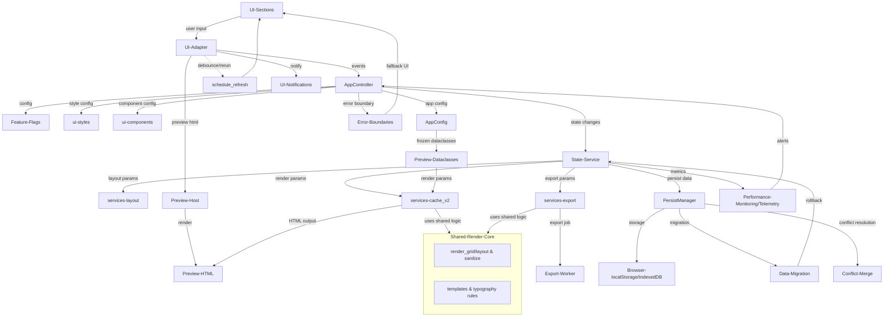
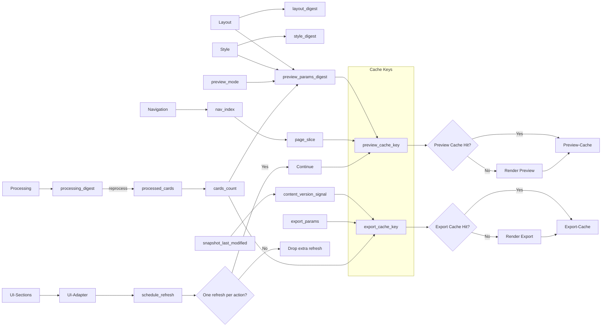
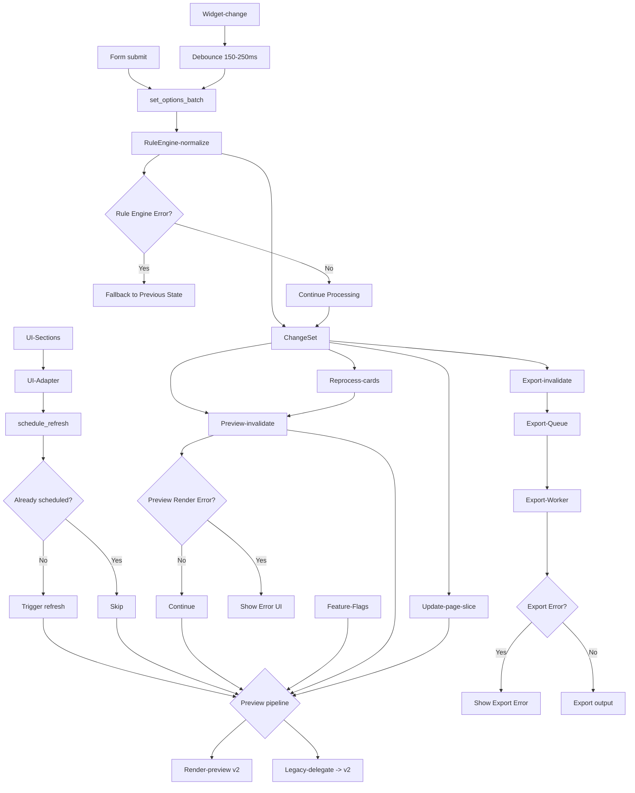

## UI 重构技术设计规范（中文）

### 1. 摘要（Executive Summary）
本设计提出对现有 UI 栈的系统性重构，以降低复杂度、提升性能并使行为可预测。核心做法：分层架构（UI → 控制器 → 状态服务 → 领域服务）、基于摘要（digest）的精确失效与重渲染、浏览器本地持久化（localStorage）与快照迁移、以及统一的预览管线（AppConfig → 冻结数据类 → HTML 预览）。清理重复/遗留路径，统一命名、单位与 API。

关键成果：
- 以域为单位的变更影响控制，杜绝全局缓存清空与意外“牵一发动全身”
- 单一写入闸门（状态服务）统一执行业务规则、批量变更、失效与持久化
- 统一预览管线（AppConfig → LayoutOptions/Typo/Visual）
- 浏览器本地持久化的 JSON 快照（版本化 + 迁移）
- 可扩展的表格式编辑器（稳定行 ID），替代多 Tab 编辑

### 2. 问题陈述（Problem Statement）
- 逻辑集中于 sections.py，UI、状态、业务、缓存清理交叉混杂
- 预览路径重复（legacy/包装/新），参数跟踪与重置规则不一致
- UI 框架内部状态到处分散读写，缓存失效散落，预览与导出时常不可预测
- Tab 式编辑器对大量卡片扩展性差
- 页面关闭后用户输入/配置不持久

### 3. 方案概览（Solution Overview）
架构：
- UI（sections/*）仅渲染与发起“意图化”调用；不直接改 UI 框架内部状态
- AppController 组装 AppConfig、编排流程与调用预览/编辑器
- 状态服务（ui/state.py）为唯一写入闸门：规则、批量、摘要、失效、持久化
- 领域服务：layout 计算、services/cache_v2（预览 HTML）、导出
- 持久化：localStorage + 版本化 JSON 快照 + 迁移
- 错误处理：错误边界、回退与优雅降级
- 性能：监控、基准与回归告警
- **开发者体验**：调试工具、职责分离、文档更新
- **UI 适配层**：UI 通过与框架无关的 `UIAdapter` 交互，而非直接使用具体框架 API；rerun/去抖/表单语义封装在适配器内（StreamlitAdapter 仅作为一种实现）。

关键决策：
- 以域（processing/layout/style/nav）为粒度计算摘要，分域失效；页面切换仅换页切片，不失效预览
- 单一预览入口：render_preview_content(processed_cards, AppConfig)
- 冻结数据类（LayoutOptions、Typography、VisualOptions）仅在 services/cache_v2 消费；UI 层持续使用 AppConfig
- 编辑器使用稳定行 ID 的表格编辑 + “应用”按钮；合并差异后一次性失效
- 缓存不使用全局 clear；缓存键包含摘要 + 会话代（generation）+ code_version + schema_version

### 4. 详细设计（Detailed Design）
#### 4.1 状态与域
- 命名空间键：
  - layout.rows/cols/auto_fill，layout.gap_cm/margin_cm/card_size
  - ui.hanzi_font_family/ui.background_color/ui.preview_mode
  - nav.current_page（= nav_index）
  - caches.preview_params_digest
- 域划分：
  - Processing：input_text、auto_pinyin、auto_translate、translate_order、segmentation
  - Layout：rows、cols、gap_cm、margin_cm、page_size、auto_fill、card_size
  - Style：hanzi_font_size_pt、pinyin_font_size_pt、english_font_size_pt、hanzi_font_family、background_color
  - Navigation：current_page（nav_index）

#### 4.2 摘要与失效
- 归一化后再哈希：浮点四舍五入至 4 位、集合排序、Decimal 字符串化
- processing_digest = stable_digest({input_text, auto_pinyin, auto_translate, translate_order})
- layout_digest = stable_digest({rows, cols, gap_cm, margin_cm, page_size, auto_fill, card_size})
- style_digest = stable_digest({hanzi_font_size_pt, pinyin_font_size_pt, english_font_size_pt, hanzi_font_family, background_color})
- preview_params_digest = stable_digest({layout_digest, style_digest, preview_mode, cards_count, PREVIEW_CACHE_SCHEMA_VERSION, code_version})
- 页面切片缓存键 = (preview_params_digest, nav_index)
- 重置规则：仅当 cards_per_page（布局改变）或 cards_count（处理改变）变化时重置/钳制 nav_index；Style 变更不重置页码

#### 4.3 规则引擎与批量变更
- set_option 累积到 pending_changes；set_options_batch 一次性应用
- 约束优先级：
  1) 用户显式改动优先
  2) 若 card_size 被调 → layout.auto_fill=False
  3) 若 layout.auto_fill=True → 依据布局重算 card_size
  4) 若 page_size/layout 改变且 auto_fill=True → 重算 card_size
  5) 批内冲突 Last-write-wins，随后进行归一化
- ChangeSet：affects_processing/layout/style/navigation/export + nav_reset_required
- 失效：在本次运行结束时基于 ChangeSet 做一次粒度化失效

#### 4.4 预览管线
- 控制器以 AppConfig 为 UI 合同（hydrate 之后），在服务边界转换为冻结数据类
- services/cache_v2 API 示例：
  - create_page_preview_html_v2(cards, page_num, layout: LayoutOptions, typo: Typography, visual: VisualOptions, code_version: str) -> str
  - cached_create_page_preview_html_v2(...同参...) -> str（键包含摘要 + generation + code_version）
  - create_simple_grid_html_v2(cards, layout, typo, visual, code_version)
- 旧函数保留、内部适配到 v2

#### 4.5 编辑器
- processed_cards 拥有稳定 id（推荐基于规范化 hanzi+pinyin+english 的内容哈希；新增用 uuid4）
- 使用框架无关的表格编辑器（由适配器实现，支持分页/搜索）；“应用”时按 id 合并差异，调用状态服务更新；仅一次失效

#### 4.6 持久化
- 快照数据类 UserSnapshot(version:int, input_text:str, options:dict, layout:dict, typography:dict, visual:dict, preview:dict)
- 版本化 JSON；migrate_snapshot(old)->new 处理字段迁移/默认
- 组件 components/browser_storage：hydrate_once()（仅一次重跑）、schedule_save()（去抖）、flush_if_due()（本次运行末尾）
- 限额：限制 input_text 长度与整体快照（~1MB）；超限警告与截断/跳过持久化
- 多标签页：监听 storage 事件，提示“检测到新设置”，提供刷新/合并选项

#### 4.7 状态服务 API
- 选择器：get_input_text()/get_layout()/get_typography()/get_visual()/get_preview_mode()/get_export_history()
- 设置器：set_option(key, value)、set_options_batch(dict)、apply_segmentation(preserve_duplicates: bool)
- 失效：invalidate_preview_cache(reason)
- 持久化：hydrate_once()/schedule_save()/flush_if_due()

#### 4.8 布局辅助
- services/layout.py：
  - compute_auto_card_size_cm(page_size:str, margin_cm:float, gap_cm:float, rows:int, cols:int) -> float
  - PaginateInfo(cards_per_page:int, total_pages:int)
  - paginate(rows:int, cols:int, total_cards:int) -> PaginateInfo

#### 4.9 安全 / 可达性 / 国际化
- HTML 渲染前对用户文本进行转义/清洗；导出复用同策略；可考虑 CSP
- 可达性：ARIA 标签、键盘导航、焦点管理、对比度校验
- Unicode 规范化（NFC/NFKC）用于比较、ID 与哈希；提供汉字/拼音字体回退

#### 4.10 命名 / 单位 / 一致性
- 统一使用 layout.rows/layout.cols；单位：尺寸用 cm，字体用 pt
- 目录/命名：services/cache_v2，ui/inputs.py（避免与内置 input 冲突）
- compute_export_key(export_params, cards_count) 替代易混淆的 compute_export_key()

### 5. 实施计划（Implementation Plan）
- P1 基础：ui/state.py（服务）、normalize_for_digest/stable_digest/invalidate_preview_cache/generation；在 2–3 个热点替换分散写与清缓存
- P2 预览统一：控制器组装 AppConfig、计算 preview_params_digest、钳制 nav_index；统一调用 render_preview_content；legacy 委托 v2
- P3 组件/样式：styles.sticky_preview()；render_color_palette 仅返回值/回调，不做副作用性失效
- P4 编辑器：引入表格编辑 + 稳定 id + 应用流
- P5 持久化：browser_storage、hydrate/schedule/flush、迁移、体积守卫
- P6 模块化：拆分 sections.py 为 ui/inputs.py、ui/options.py、ui/preview.py、ui/editor.py、ui/export.py、ui/sidebar.py
- P7 收尾与开关：特性开关新管线；弃用旧预览路径；缓存有界；统一命名

### 6. 测试策略（Testing Strategy）
- 单测：摘要归一化/舍入、paginate/compute_auto_card_size_cm/compute_export_key、数据类等值/哈希、规则优先级、分词幂等
- 集成：预览摘要变更仅在 layout/processing 时触发重置；style 变更不重置；批量变更仅一次失效；多会话隔离（session_generation）
- E2E（事件驱动，无休眠）：首次 hydrate 单次重跑、按 id 应用编辑、CSV 错误恢复、分词失败恢复、缓存命中/未命中；golden HTML 归一化对比（迁移期 v1==v2）
- 性能：首次摘要变更后的渲染 < 500ms（grid），缓存渲染 < 100ms；埋点记录

### 7. 风险评估（Risk Assessment）
- 缓存/版本漂移：缓存键加入 PREVIEW_CACHE_SCHEMA_VERSION 与 code_version；禁止全局清
- 重跑循环：微批到 pending_changes，运行末合并一次；避免中途失效
- 并发：会话级 generation；多标签 storage 事件提示
- 大输入：体积守卫 + 截断告警
- 安全：转义用户内容；导出同策略
- Hydration 竞态：持久 hydrated 标记；hydrate 期间 setter 空操作
- 内存：TTL + max_entries + 单条上限；驱逐统计展示于调试面板

### 8. 附录（Appendices）
A. 架构/流程图（Mermaid）
- 架构概览

- 影响与摘要

- 重跑范围控制

B. 简要 Schema
- PaginateInfo(cards_per_page:int, total_pages:int)
- LayoutOptions(rows:int, cols:int, auto_fill:bool, card_size_cm:float, gap_cm:float, margin_cm:float, page_size:str)
- Typography(font_hanzi_pt:int, font_pinyin_pt:int, font_english_pt:int, hanzi_font_family:str)
- VisualOptions(background_color:str)
- UserSnapshot(version:int, input_text:str, options:dict, layout:dict, typography:dict, visual:dict, preview:dict)

C. 缓存键/版本
- 所有缓存函数参数包含：preview_params_digest、session_generation、code_version、PREVIEW_CACHE_SCHEMA_VERSION

D. 错误处理示例
- localStorage 不可用 → 走默认值 + 信息提示
- 快照超限 → 告警、截断 input_text、跳过持久化
- CSV/分词错误 → 友好错误 + 保留上一有效状态

E. 单位与舍入
- 尺寸 cm、字体 pt；浮点摘要前统一保留 4 位；cm↔px 转换在渲染统一处理

F. 补充规范（P0/P1/P2 优先级）

#### P0 高优先级规范

**时间与序列化规范**
- 所有 datetime 字段统一使用 ISO‑8601 UTC 字符串格式：`YYYY‑MM‑DDTHH:mm:ss.sssZ`
- 时间源策略：UI 交互使用浏览器时间，code_version 使用服务器/构建时间
- 时钟偏差处理：优先信任服务器时间戳，调试时记录浏览器与服务器时间
- localStorage/IndexedDB 仅存储 JSON 可序列化原始类型，禁止直接存储 Date 对象

**导出缓存键内容版本信号**
- 导出缓存键必须包含内容版本信号：`compute_export_key(export_params, cards_count, content_version_signal[, ...])`
- 内容版本信号来源：`snapshot_last_modified` 或递增的 `cards_version` 计数器
- 避免对全文内容做哈希，确保内容变更时精准失效缓存

**适配器去抖/节流落地实现（示例：StreamlitAdapter）**
- 批处理设置：使用表单语义（由适配器实现；在 StreamlitAdapter 中使用 `st.form`），统一触发 `set_options_batch()`
- State Service 层实现 150–250ms 去抖窗口，合并快速变更
- 避免中途失效与多次 rerun，在运行结束时原子性应用所有变更

**规则引擎不变量与幂等性**
- 不变量清单：
  - `auto_fill=True` 时 `card_size` 为派生值
  - 用户显式设定 `card_size` 时自动关闭 `auto_fill`
  - Style-only 变更不重置导航
  - 批更新原子性，部分失败时回滚
- 冲突解决：显式用户变更 > 派生值，提供用户可见反馈
- 幂等性：重复应用相同批次产生相同状态

#### P1 中优先级规范

**Session Generation 语义澄清**
- 定义：会话启动时生成的唯一标识符，在同一浏览器会话的 rerun 间持久
- 作用域：单浏览器会话，不跨标签页共享
- 与 correlation_id 关系：correlation_id 为每次交互，session_generation 为整个会话
- 状态机：页面加载生成 → 会话期间持久 → 页面重载重置

**Code Version 取值优先级与可复现性**
- 开发环境：`dev-{short_sha}-{YYYYMMDDHHMMSS}`（工作树不干净时追加 `-dirty`）
- CI 环境：`ci-{BUILD_NUMBER}-{short_sha}`（构建号缺失时回退到 sha）
- 生产环境：`v{semver}` 或 `v{semver}+build.{build_number}`
- 确保缓存键在不同环境可重现

**缓存策略与观测细化**
- 观测指标：命中率、p95/p99 渲染耗时、逐键大小 Top‑N、逐类缓存淘汰率
- 预热策略：digest 变更后对下一个 page-slice 预渲染
- 告警阈值：缓存命中率 < 80%、p95 渲染时间 > 500ms、内存使用 > 100MB

**预取与重任务隔离**
- 预览分页：nav_index 变化时预取 ±1 的 page-slice（低优先级执行）
- 重任务隔离：导出/大预览在线程池/子进程中执行，支持超时与取消
- 当新 digest 到来时中止旧任务，避免阻塞主渲染路径

**错误边界与恢复顺序**
- 分层清理顺序：page-slice → preview → export → session（仅在检测到损坏时）
- 避免全局缓存清理
- 每个 UI 片段包装 try/except，输出降级 UI 与结构化错误日志

**单位/DPI 与渲染一致性**
- 固定换算常数：96 DPI 下 1cm ≈ 37.795px
- 四舍五入策略：哈希前保留 4 位小数
- 屏幕与 PDF/PPT 差异处理：安全内边距或预排版度量

**Editor 行为细化**
- 排序稳定性：UUID 作为主键，保序字段与比较规则
- 版本号递增策略：每次编辑原子递增，用于冲突解决
- 原子预览失效：合并所有编辑变更后集中触发一次预览失效

#### P2 低优先级规范

**命名与 JSON 风格统一**
- 统一使用 snake_case 作为 JSON 键名
- 序列化层做单点转换，避免跨端风格漂移
- 第三方 API 需要 camelCase 时使用适配器

**性能事件模型示例**
- 事件字段：correlation_id、preview_params_digest、session_generation、elapsed_ms、operation_name、cache_hit/miss
- 采样率：错误 100%、常规操作 10%、高频事件 1%
- 端到端串联保证

**Feature Flag 运维细节**
- 覆盖优先级：环境变量 > 配置文件 > 远程服务 > 默认值
- 远程服务缓存 TTL：5 分钟，失败时指数退避
- 测试覆写：使用上下文管理器 `with feature_flag('new_preview', True):`

**测试增强**
- 规则引擎性质测试：验证不变量与边界条件
- v1/v2 行为一致性黄金测试：启用开关时的等价输出
- 性能回归阈值与失败处理：自动降级或阻断发布

#### 增强性能监控

**缓存预热策略**
- 首次访问：digest 变更后在后台预渲染下一个 page-slice
- 预测性加载：分析用户导航模式，预预热可能访问的页面
- 内存感知：限制预热到 2-3 页，避免内存压力

**内存使用模式**
- 峰值场景：大数据集（>1000 卡片）、多次导出、并发用户
- 垃圾回收：导出完成后显式清理，定期缓存驱逐
- 内存限制：软限制 100MB，硬限制 200MB，支持优雅降级

**并发处理能力**
- 导出队列：每个用户会话最多 3 个并发导出
- 超时：每个导出任务 30 秒超时，支持取消
- 资源隔离：重任务使用独立线程池

#### 增强错误处理

**降级策略**
- 核心功能：始终维护基本输入/显示能力
- 渐进增强：依赖失败时禁用高级功能
- 优雅降级：复杂功能失败时回退到简单渲染

**错误分类**
- 严重（立即）：状态服务失败、持久化损坏
- 警告（用户操作）：缓存未命中、性能下降
- 信息（后台）：非关键功能失败、遥测问题

**用户通知机制**
- 严重：模态对话框，明确操作项和恢复步骤
- 警告：Toast 通知，支持关闭
- 信息：调试面板中的微妙状态指示器

#### 全面测试策略

**压力测试**
- 大数据集：使用 10,000+ 卡片测试内存和性能
- 并发用户：模拟 50+ 同时用户
- 扩展会话：8+ 小时连续使用模式

**兼容性测试**
- 浏览器：Chrome、Firefox、Safari、Edge（最新 2 版本）
- 设备：桌面、平板、移动响应式设计
- 操作系统：Windows、macOS、Linux

**回归测试**
- 自动化测试套件：关键路径 100% 覆盖
- 黄金测试：比较 v1 vs v2 相同输入的输出
- 性能回归：>10% 性能下降时自动告警

#### 4.17 缓存策略
- **分层**: 会话（用户配置）、预览（渲染后的 HTML 片段）、导出（PDF/PPTX 文件）。
- **键**: 预览使用 `preview_params_digest`。导出键必须包含一个内容版本信号（`content_version_signal`），其定义为所有卡片 `(uuid, version)` 元组有序列表的哈希值，以确保当卡片内容变更（即使数量不变）时缓存能失效。
- **驱逐**: 采用 LRU 策略，并为每个缓存层级配置 `max_entries` 和 `ttl`（例如，预览缓存：100 条目，1 小时 TTL）。
- **观测**: 追踪命中率、p95/p99 延迟、键大小分布和驱逐率。
- **规则**:
  - 禁止全局缓存清理（例如 `st.cache_data.clear()`）。失效操作必须是精准的、针对特定缓存层级的。

#### 4.18 错误处理与边界
- **可测试性**: 在开发环境中，遥测报告可以切换为写入本地文件。这使得自动化测试能够验证遥测事件的结构和触发是否正确，而无需依赖一个完整的监控后端。

#### 4.23 并发隔离
- **导出队列**: 一个专用的线程池（最多 3 个工作线程）管理导出任务。任务有 30 秒超时并可取消。

#### 4.24 共享渲染核心 API 草案
- **API 草案**: 共享渲染核心函数的接口设计草案如下：
  - `RenderOptions(dataclass)`: 包含所有渲染所需参数（字体、颜色、尺寸、边距等）。
  - `Card(dataclass)`: 包含单个卡片的内容。
  - `render_page(cards: List[Card], options: RenderOptions) -> RenderResult`: 核心函数，返回一个 `RenderResult` 对象，其中包含渲染结果（如 HTML/SVG）和元数据（如计算后的尺寸）。

#### 4.5 编辑器
- **状态**: 每个卡片是一个包含稳定 UUID、内容（`hanzi`, `pinyin`, `english`）、版本号和时间戳的对象。
- **数据模型迁移**: 为提升清晰度并避免单位错误，`core.config.LayoutConfig` 中的 `gap` 和 `margin` 等配置字段将重命名为 `gap_cm` 和 `margin_cm`。一个适配层将兼容读取旧版状态快照，并在保存时通过迁移步骤将这些字段规范化。

4.0 UI 端口 / 适配器层
- 目标：解耦 UI 与 Streamlit，使其可迁移到其他框架（React+FastAPI、PySide、Textual/TUI 等），而无需改动领域/状态/渲染/导出逻辑。
- 接口（ui/ports.py）：
  - `UIAdapter` 聚合：`UIInputsPort`、`UIPreviewPort`、`UINotificationPort`、`UIRefreshScheduler`。
  - `UIInputsPort`：text/checkbox/select/color/file_uploader/button/form；均接受 `(event_name, payload)` 形式的 `on_change`/`on_click` 处理器。
  - `UIRefreshScheduler.schedule_refresh(debounce_ms=0)`：调度 UI 刷新；Streamlit 实现为 去抖(150–250ms)+`st.rerun()`；其它框架映射为 setState/信号。
  - `UIFormContext`：上下文管理器，提供 `on_submit(handler)` 用于表单提交触发批量设置。
- Streamlit 适配器（ui/adapters/streamlit_adapter.py）：以 Streamlit 实现端口；隐藏 `st.form`、`st.rerun` 与去抖细节。
- FakeAdapter：用于测试的内存适配器，记录事件与刷新调用次数。
- 合同约束：
  - UI 代码禁止直接调用 `st.*`；只能使用 `UIAdapter`。
  - 刷新必须通过 `schedule_refresh`；一次用户操作最多触发一次刷新。
  - UI 不得直接清缓存或写持久化；统一通过状态服务完成。
- 特性开关：`FEATURE_UI_ADAPTER={streamlit|fake|custom}`；默认 `streamlit`。
- 迁移计划：
  1) 引入端口与 StreamlitAdapter，保留旧路径。
  2) 先在一个小段落试点迁移（受 flag 控制）。
  3) 按段落逐步覆盖；移除直接 `st.*` 调用。
  4) 黄金对比通过后将适配器设为默认；保留 legacy 回退。
- 测试：
  - 单测：FakeAdapter 行为；刷新去抖；表单提交 → `set_options_batch`。
  - 集成：使用 FakeAdapter 走全流程；断言一次操作仅一次刷新。
  - E2E：保持不变；在开发态记录首帧时延与 rerun 次数。

